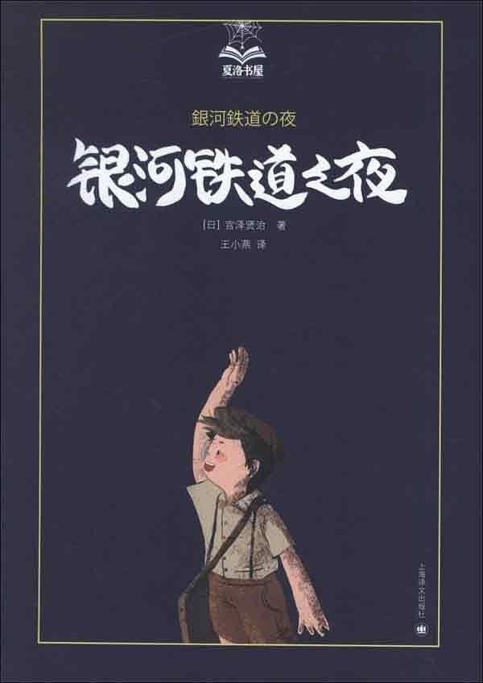
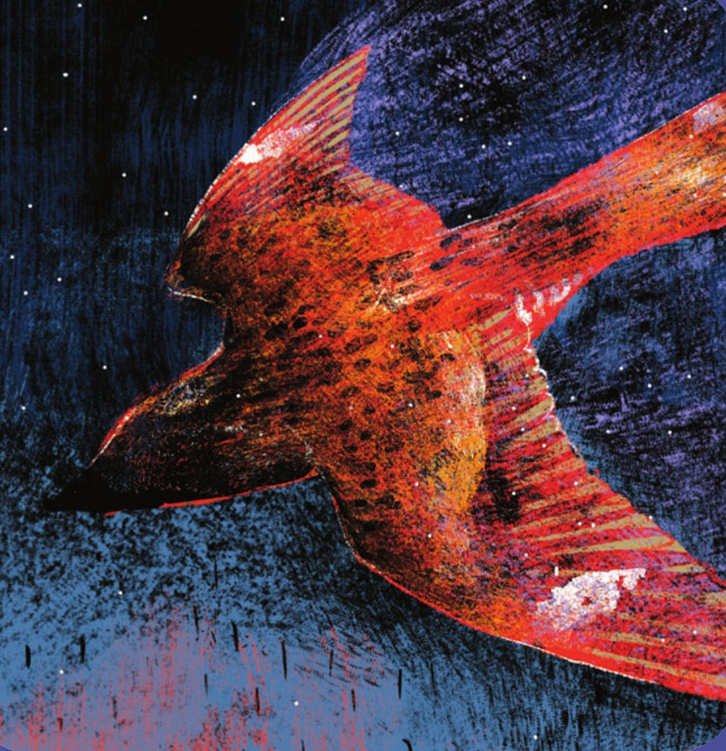
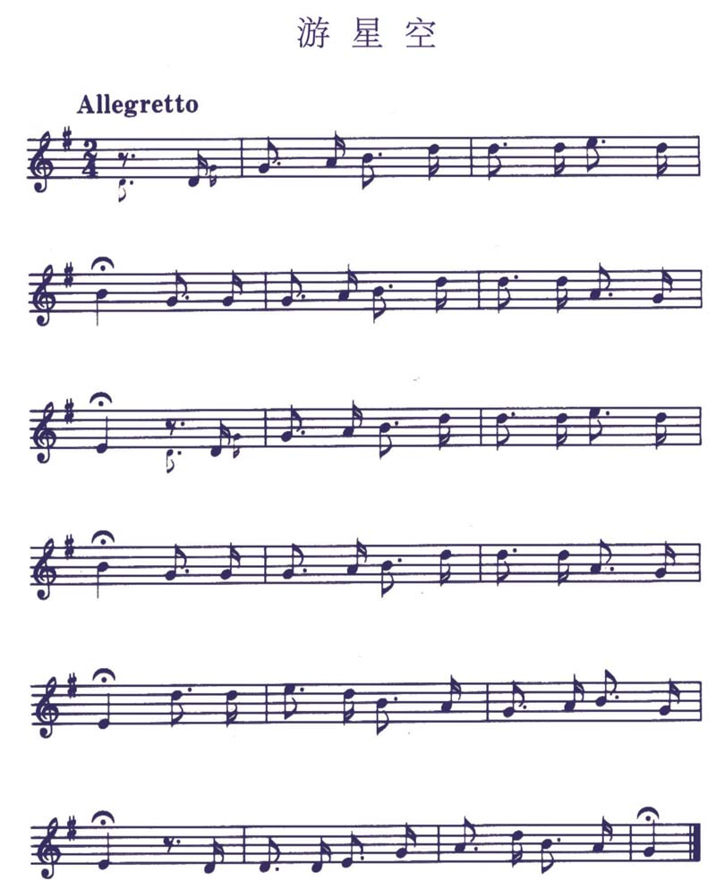
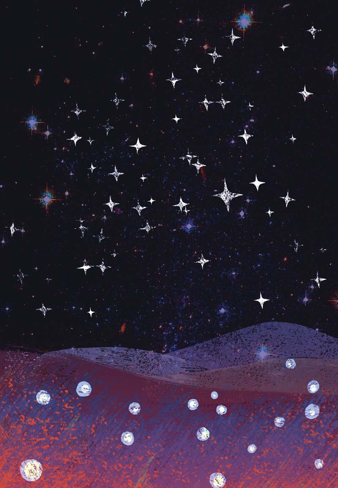
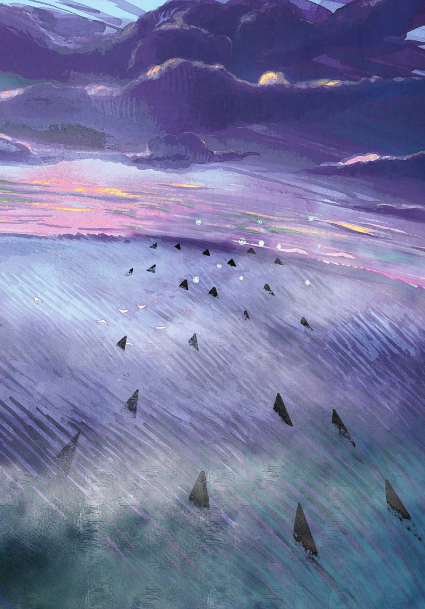

银河铁道之夜
==================




```
作者: [日] 宫泽贤治
出版社: 上海译文出版社
译者: 王小燕
出版年: 2013-6
页数: 205
定价: 38.00元
装帧: 精装
丛书: 夏洛书屋
ISBN: 9787532761531
```

### 评价 ###


### 摘抄 ###

01 夜鹰星



他噙着眼泪，又一次抬头看了看天空。是的，这就是夜鹰的最后一刻！他早已不知自己是在下坠，还是继续在上升？是头朝着地，还是向着天？但他的内心非常平静，他那粘满血迹的大鸟喙虽然已歪向了一旁，但嘴角的确有着一抹微笑。

02 双子星

天上的白云你绽放光芒吧
把太阳要走的路打扫干净吧！
天上的青云你快快出来吧
把太阳坐的石凳埋得再深些吧！

眼睛啊红彤彤的是天蝎
展翅膀翩翩飞的是天鹰
眼珠子蓝幽幽的小天犬
还有那金灿灿的亮天蛇

猎户星高挂天空唱着歌
向人间洒下无数霜和露
仙女座朦朦胧的星云啊
就好像一条鱼儿张开嘴

憨厚的大熊把脚朝向北
向前方迈步再走五颗星
那可爱小熊星的前额处
是我们星空游的目的地



只见那颗苍白色光芒的巨大彗星，头、尾和身体早已四分五裂，它疯子般声嘶力竭地嘶鸣着，刺啦刺啦地闪着光，朝着那漆黑的大海坠落而下。

03 猫的事务所


05 银河铁道之夜






哪怕我就在那个巨大的黑洞里，也不害怕。我一定要去寻找大家真正的幸福，无论到哪里，让我们都一起往前走吧！

可是，刚刚还端坐着康帕内拉的座位上，早已不见了他的身影，只剩下黑色的天鹅绒还闪着光。乔万尼蹭地一下站了起来，就像出膛的子弹一样。为了不让人听见他的呐喊，他把身体伸出窗外，用尽了浑身的力量猛烈地捶打着胸膛大声叫喊，然后就嚎啕大哭起来，他觉得身边顿时就陷入一片漆黑。


### 参考链接 ###

[银河铁道之夜 (豆瓣)](https://book.douban.com/subject/24754239/)

