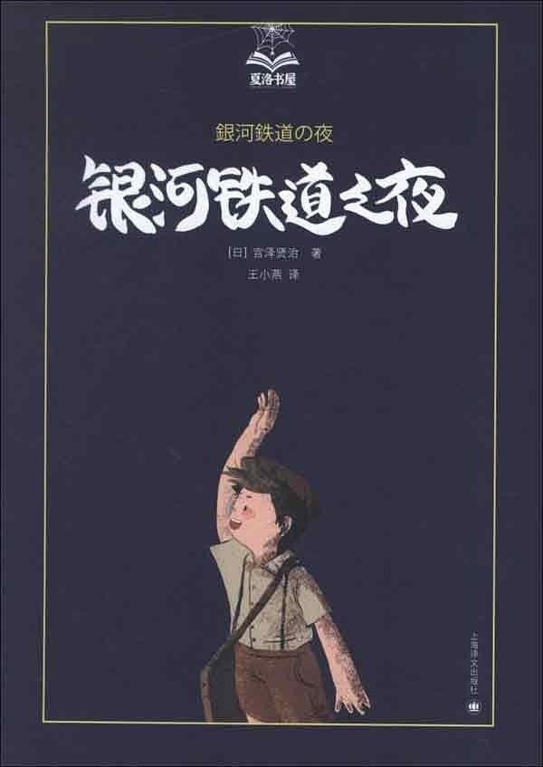

银河铁道之夜
==================



```
作者: [日] 宫泽贤治
出版社: 上海译文出版社
译者: 王小燕
出版年: 2013-6
页数: 205
定价: 38.00元
装帧: 精装
丛书: 夏洛书屋
ISBN: 9787532761531
```

参考链接: [银河铁道之夜 (豆瓣)](https://book.douban.com/subject/24754239/)

### 摘抄 ###

01 夜鹰星
 
他噙着眼泪，又一次抬头看了看天空。是的，这就是夜鹰的最后一刻！他早已不知自己是在下坠，还是继续在上升？是头朝着地，还是向着天？但他的内心非常平静，他那粘满血迹的大鸟喙虽然已歪向了一旁，但嘴角的确有着一抹微笑。

02 双子星

只见那颗苍白色光芒的巨大彗星，头、尾和身体早已四分五裂，它疯子般声嘶力竭地嘶鸣着，刺啦刺啦地闪着光，朝着那漆黑的大海坠落而下。

03 猫的事务所

04 奥茨贝尔和大象

咣当咣当、咣当咣当……这辆漂亮的小火车就这样在风儿掀起阵阵波浪的满天芒草中、在天河水和三角标发出的青白色微光里
